# SecureScope / GitHub Security Review Tool


> AI-powered security analysis for any GitHub repository. Paste a URL, get a full threat report mapped to MITRE ATT&CK and CWE, with optional Docker sandbox execution and AI-generated fix diffs from your choice of LLM.
> **v7.0.0** adds SARIF 2.1.0 export (GitHub Security tab integration), Trivy container image scanning, CycloneDX SBOM generation, compliance posture reports (PCI DSS / NIST / OWASP / SANS Top 25), multi-repo scanning, and a GitHub webhook trigger server. **v6.2.0** completed the security report — Secrets Detection and Dependency Vulnerability sections fully rendered in report.html. **v6.0.0** adds an IaC Misconfiguration Scanner — Terraform, Kubernetes, Dockerfiles, GitHub Actions, CloudFormation, and Ansible. **v5.0.0** expanded the YARA library to 11 rule sets. **v4.0.0** added a Dependency Vulnerability Scanner (OSV.dev). **v3.0.0** added a Secrets Detection Engine with 60+ patterns and git history scanning.

**[View Sample Report (PDF)](https://github.com/OmarRao/secure-scope/blob/main/docs/sample_report.pdf)**

---

## Landing Page

Click **Analyze Repository** to open the scan wizard. The landing page lists all capabilities and recent scans, and supports both dark and light themes via the toggle in the top-right corner.

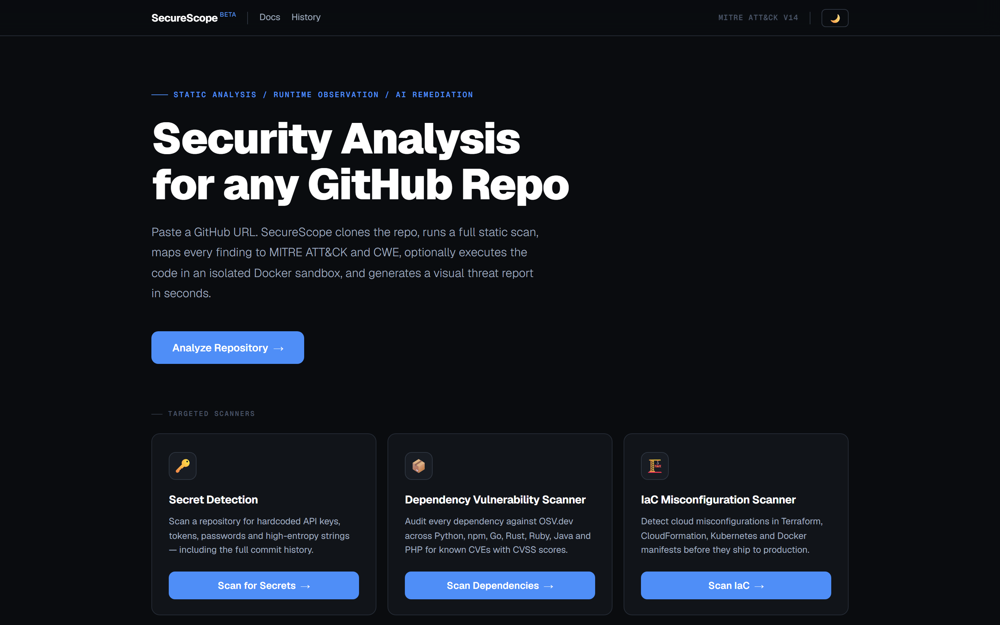

---

## Scan Wizard

Repository analysis is launched through a 3-step modal wizard.

### Step 1 — Repository

Enter the GitHub repository URL and target branch.

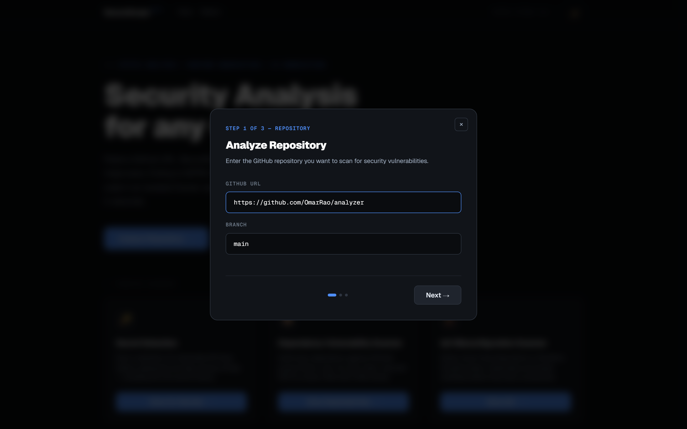

### Step 2 — AI Provider

Choose which LLM to use for fix generation. All major providers are supported with free tiers available.

| Provider | Model | Notes |
|----------|-------|-------|
| Anthropic Claude | claude-sonnet-4-5 | Best quality |
| OpenAI GPT-4o | gpt-4o | Fast and capable |
| Google Gemini | gemini-1.5-flash | Free tier |
| Groq Llama 3.1 | llama-3.1-70b-versatile | Ultra fast |
| Ollama (local) | llama3 | No API key required |
| None | N/A | Skip advisor |

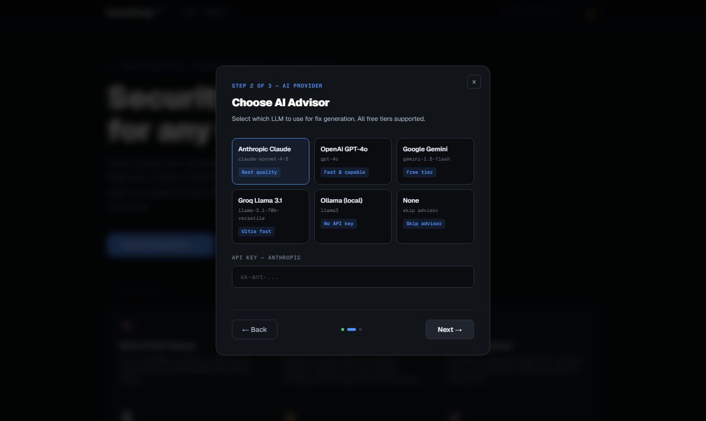

### Step 3 — Scan Options

Configure Docker sandbox execution and optional auto-commit of AI-generated fixes to GitHub.

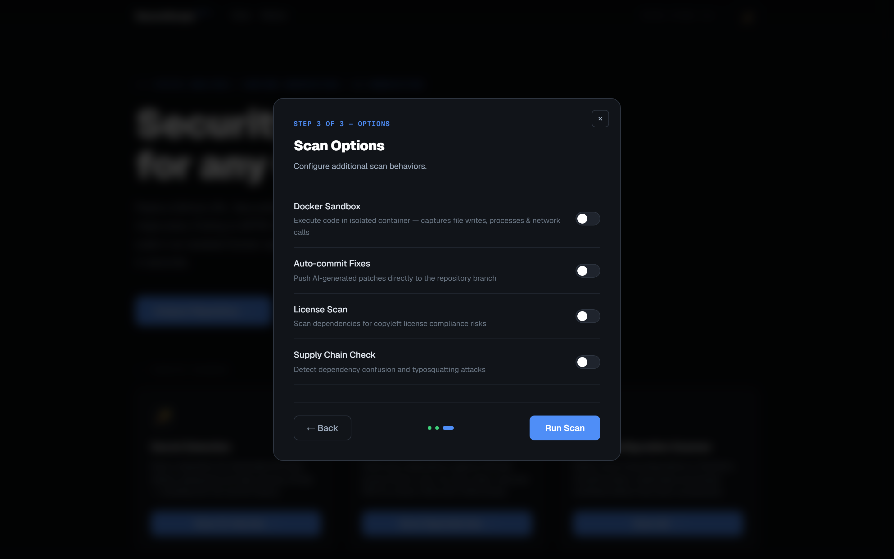

---

## Threat Intelligence Dashboard (v2.0.0)

A live threat intelligence panel sits below the scan wizard on the main dashboard. No scan is required — it loads automatically on page visit and auto-refreshes every 60 seconds.

### Live Threat Feed & Top 10 Active Variants

Real-time tracking of 26 ransomware groups and APT actors ranked by severity. Click any row to expand full details: TTPs, CVEs, IOCs, affected sectors, and step-by-step prevention guidance.

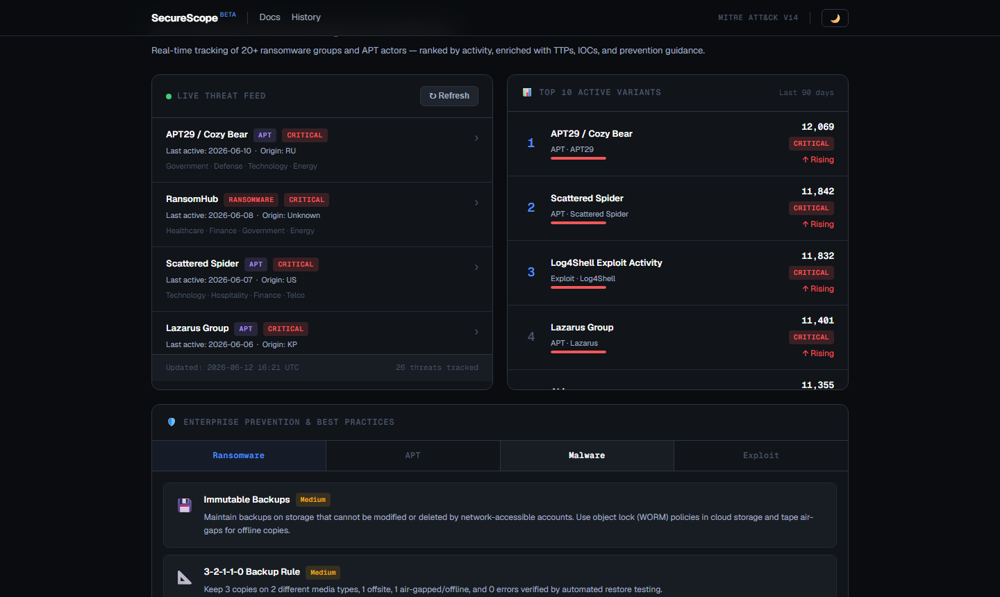

### Data Protection & Resilience + YARA Scanner

The 3-2-1-1-0 backup rule visualised with an interactive DR testing checklist (state saved to localStorage). The YARA Scanner panel lets you scan any local path — backups, infrastructure directories — against 6 predefined rule sets in real time via WebSocket progress streaming.

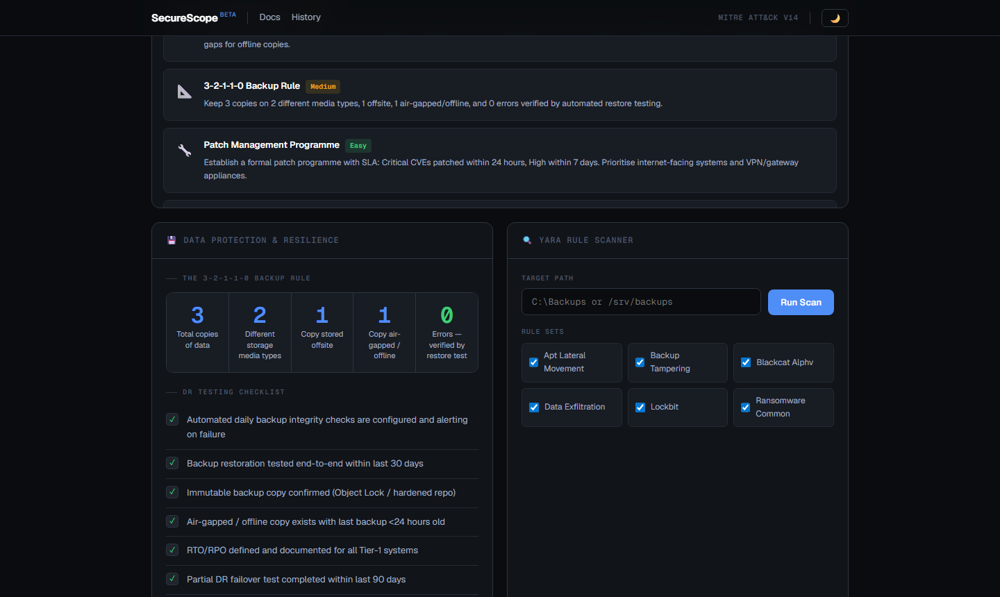

### Threat Intelligence Feature Summary

| Panel | Description |
|-------|-------------|
| **Live Threat Feed** | Scrollable feed of 26 tracked ransomware and APT groups, sorted by severity. Click any row to expand TTPs, CVEs, IOCs, and prevention steps. |
| **Top 10 Active Variants** | Ranked list of most active threats in the last 90 days with detection counts, severity bars, and trend indicators. |
| **Enterprise Prevention** | Tabbed cards (Ransomware / APT / Malware / Exploit) with actionable controls, difficulty ratings, and icons. |
| **Data Protection & Resilience** | 3-2-1-1-0 backup rule visual guide plus an interactive DR testing checklist (state saved to localStorage). |
| **YARA Scanner** | Scan any local path against 11 rule sets covering ransomware, APT lateral movement, data exfiltration, credential harvesting, living-off-the-land, and supply chain attacks. Streams live progress via Socket.IO. |
| **IaC Misconfiguration Scanner** | Scan any repo for cloud and container misconfigurations across 6 frameworks. Uses checkov when installed; falls back to 50+ built-in pattern checks with zero dependencies. |

### YARA Rule Sets

| File | Coverage |
|------|----------|
| `ransomware_common.yar` | Generic ransomware: file extension change, ransom notes, VSS deletion, CryptoAPI |
| `lockbit.yar` | LockBit 3.0: ransom note format, dropper anti-analysis, defence evasion |
| `blackcat_alphv.yar` | BlackCat/ALPHV: Rust binary markers, config JSON, ESXi targeting |
| `apt_lateral_movement.yar` | Mimikatz, LSASS dump, WMI lateral movement, AD recon, scheduled task persistence |
| `data_exfiltration.yar` | Rclone cloud exfil, cURL upload, FTP staging, 7-Zip data archiving |
| `backup_tampering.yar` | Veeam service stop, Windows Backup deletion, agent process kill, NAS share deletion |
| `clop.yar` | Cl0p ransomware: ransom notes, MOVEit/GoAnywhere exploitation (CVE-2023-34362, CVE-2023-0669), defence evasion |
| `emerging_ransomware.yar` | Play, Akira, RansomHub, Black Basta, Hunters International: latest 2024–2025 ransomware families |
| `lotl_techniques.yar` | Living-off-the-Land: certutil, mshta, regsvr32 Squiblydoo, wscript/cscript, bitsadmin, PowerShell download cradles, rundll32 |
| `credential_harvesting.yar` | Browser credential theft (Chrome/Edge/Firefox), DPAPI abuse, SAM/NTDS dump, Kerberoasting, LSA secrets, cloud credential theft |
| `supply_chain_attacks.yar` | Dependency confusion, CI/CD pipeline tampering (GitHub Actions/GitLab/Jenkins), malicious npm/PyPI packages, Docker image poisoning |

Install `yara-python` for full scanning capability:
```bash
pip install yara-python
```
Without it, the scanner gracefully degrades: files are counted but no rules are evaluated.

---

## Sample Report

The screenshots below are taken from a live scan of [`OmarRao/analyzer`](https://github.com/OmarRao/analyzer), a deliberately vulnerable Python Flask banking application containing 414+ findings across multiple MITRE ATT&CK techniques.

**[View Full Sample Report (PDF)](https://github.com/OmarRao/secure-scope/blob/main/docs/sample_report.pdf)**

---

### Report Header & KPI Summary

The report header shows repository name, branch, language, license, scan timestamp, and a prominent **Risk Score** badge (0–100) with threat grade. Five KPI cards break down critical findings, warnings, dependency CVEs, ATT&CK technique count, and sandbox exit code.

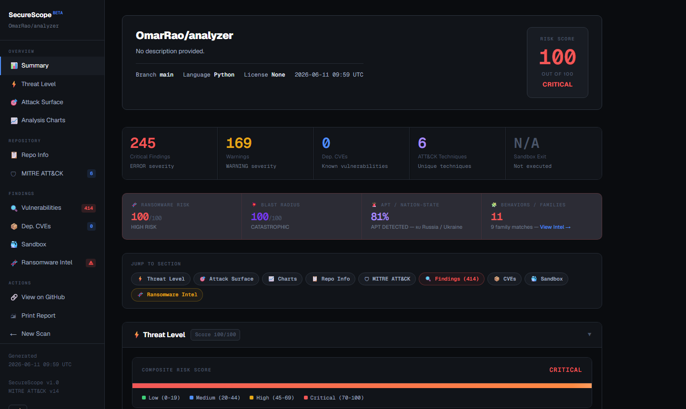

---

### Ransomware Intelligence Strip & Jump Navigation

The ransomware summary strip appears at the top of every report — showing Ransomware Risk score, Blast Radius, APT/Nation-State confidence, and Behaviors/Families count at a glance. Below it, a pill navigation bar lets you jump directly to any section.

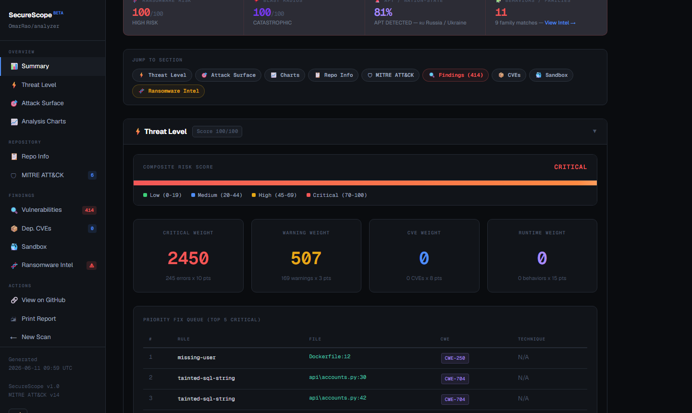

---

### Analysis Charts

Six interactive Chart.js visualisations:

- **Severity Distribution** — Doughnut chart of Critical / Warning / Info counts
- **ATT&CK Technique Radar** — Radar plot across detected technique IDs
- **Findings by File** — Horizontal heatmap bars ranked by finding density
- **Severity per File** — Stacked bar chart (top 6 files, split by severity)
- **Language Risk Distribution** — Polar area chart from GitHub language stats
- **CWE Category Breakdown** — Horizontal bar of all CWE IDs ranked by frequency

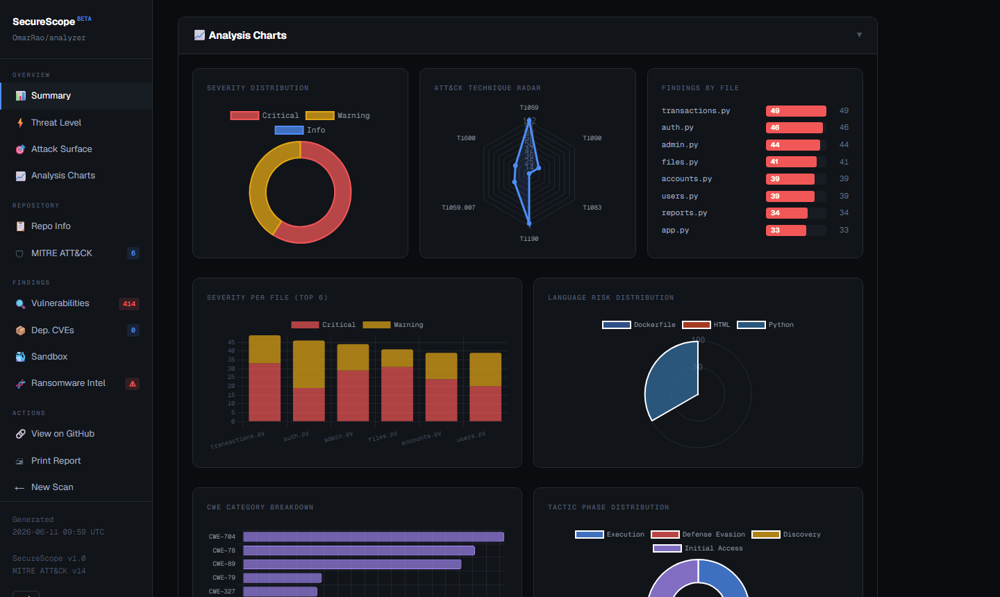

---

### Vulnerability Findings Table

Filterable by severity (All / Critical / Warning) with a live search box across rule ID, file path, CWE, and ATT&CK technique. Each row shows severity badge, Semgrep rule ID, file and line number, CWE tag, ATT&CK technique, tactic, and an expandable AI Fix Advisory panel when an LLM is configured.

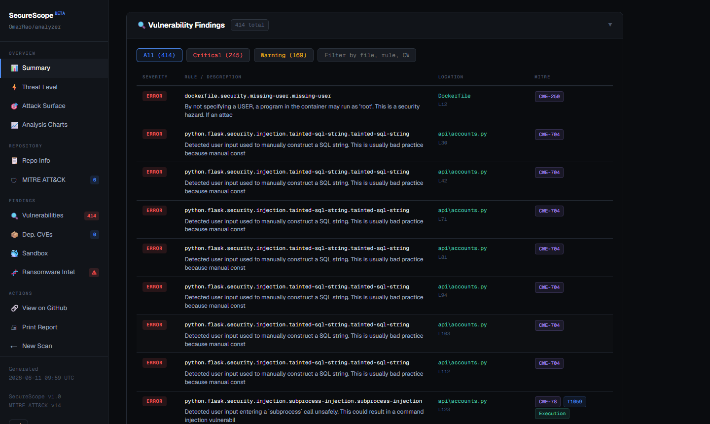

---

### Ransomware Intelligence Section

Full ransomware intelligence breakdown: hero KPI cards (risk score, blast radius, APT likelihood), behavioural pattern table, family match cards with origin/CVE/confidence data, a canvas-rendered global impact map, CVE cross-reference table, and affected code sections list.

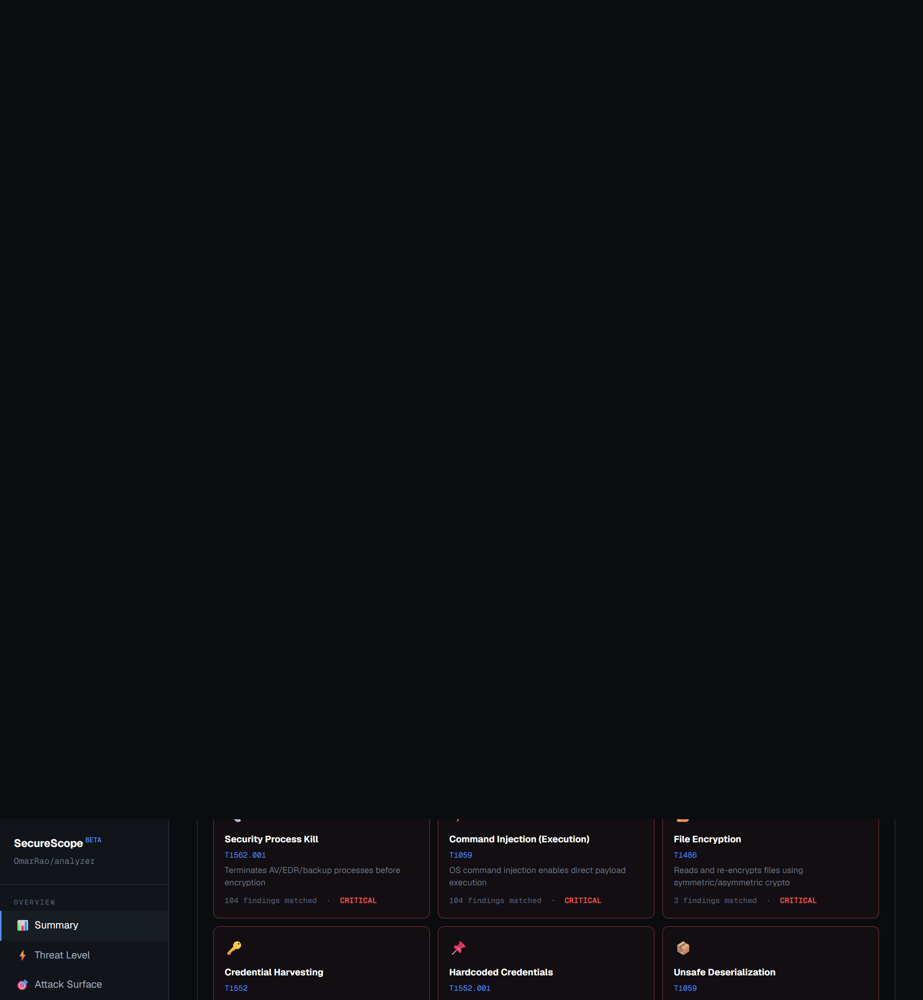

---

## Architecture

```
main.py              CLI entry point
analyzer.py          Semgrep static scan + CWE -> ATT&CK mapping + dep CVEs
sandbox.py           Docker isolated runtime execution with strace observation
advisor.py           Multi-LLM fix advisor (Anthropic, OpenAI, Gemini, Groq, Ollama)
ransomware.py        Ransomware detection engine (9 families, 14 behaviors, blast radius)
threat_intel.py      Threat intelligence engine: 26 threat DB, feed, prevention guide
yara_scanner.py      YARA rule engine for backup/infrastructure scanning
iac_scanner.py       IaC misconfiguration scanner (Terraform, K8s, Dockerfile, GHA, CF, Ansible)
yara_rules/          YARA .yar rule files (11 rule sets, 50+ rules total)
github_agent.py      Auto-commit security fixes to GitHub branch
report.py            HTML + JSON report generation
ui/
  server.py          Flask + Socket.IO web server (scan pipeline + threat intel API)
  github_info.py     GitHub API fetcher (stars, commits, contributors, languages)
  templates/
    index.html       Dashboard: wizard, live pipeline, threat intel panels
    report.html      Visual report with Chart.js, threat scoring, attack surface
```

---

## Prerequisites

| Requirement | Purpose |
|-------------|---------|
| Python 3.11+ | Runtime |
| Docker Desktop | Sandbox execution (optional) |
| `git` | Repository cloning |
| LLM API key | AI fix advisor (optional) |
| GitHub PAT (classic, `repo` scope) | Committing fixes (optional) |

---

## Setup

```bash
pip install -r requirements.txt

# For additional LLM providers (optional):
pip install openai google-generativeai groq

# For YARA scanning (optional):
pip install yara-python
```

Set environment variables (the wizard also accepts keys interactively):

```bash
# Windows PowerShell
[System.Environment]::SetEnvironmentVariable("ANTHROPIC_API_KEY", "sk-ant-...", "User")
[System.Environment]::SetEnvironmentVariable("OPENAI_API_KEY", "sk-...", "User")
[System.Environment]::SetEnvironmentVariable("GEMINI_API_KEY", "...", "User")
[System.Environment]::SetEnvironmentVariable("GROQ_API_KEY", "gsk_...", "User")
[System.Environment]::SetEnvironmentVariable("GITHUB_TOKEN", "ghp_...", "User")
```

---

## Usage

### Web UI (recommended)

```bash
python -m ui.server
# Open http://localhost:5001
```

Click **Analyze Repository** and follow the 3-step wizard:
1. Enter GitHub URL and branch
2. Choose your AI provider (or skip)
3. Configure sandbox and auto-commit options

### CLI

```bash
# Static analysis only
python main.py --repo https://github.com/owner/repo --no-sandbox --no-advisor

# Full scan with Docker sandbox
python main.py --repo https://github.com/owner/repo --no-advisor

# Full scan with AI fix advisor
python main.py --repo https://github.com/owner/repo --no-sandbox

# Full scan + commit fixes to GitHub
python main.py --repo https://github.com/owner/repo --commit --branch main

# Full scan with SARIF + SBOM + compliance posture report
python main.py --repo https://github.com/owner/repo --sarif --sbom --compliance --no-advisor

# Include Trivy container image scan alongside static analysis
python main.py --repo https://github.com/owner/repo --image python:3.11-slim --no-advisor

# Multi-repo scan (comma-separated)
python main.py --repos https://github.com/org/repo1,https://github.com/org/repo2 --no-advisor

# Multi-repo scan from a file (one URL per line)
python main.py --repos-file repos.txt --sarif --sbom --no-advisor

# Webhook server — auto-trigger scans on GitHub push/PR events
python main.py --webhook --port 8080 --webhook-secret <secret>
```

---

## Supported AI Providers

| Provider | Model | Free Tier | API Key Env Var |
|----------|-------|-----------|-----------------|
| Anthropic Claude | claude-sonnet-4-5 | No | `ANTHROPIC_API_KEY` |
| OpenAI | gpt-4o | Limited | `OPENAI_API_KEY` |
| Google Gemini | gemini-1.5-flash | Yes | `GEMINI_API_KEY` |
| Groq | llama-3.1-70b-versatile | Yes | `GROQ_API_KEY` |
| Ollama (local) | llama3 | Yes (local) | None required |
| None | N/A | N/A | N/A |

---

## MITRE ATT&CK Mapping

| CWE | ATT&CK Technique | Tactic |
|-----|-----------------|--------|
| CWE-89 | T1190 Exploit Public-Facing Application | Initial Access |
| CWE-79 | T1059.007 JavaScript | Execution |
| CWE-78 | T1059 Command and Scripting Interpreter | Execution |
| CWE-22 | T1083 File and Directory Discovery | Discovery |
| CWE-798 | T1552.001 Credentials in Files | Credential Access |
| CWE-918 | T1090 Proxy | Defense Evasion |
| CWE-327 | T1600 Weaken Encryption | Defense Evasion |
| CWE-502 | T1059 Command and Scripting Interpreter | Execution |
| CWE-352 | T1562 Impair Defenses | Defense Evasion |
| CWE-611 | T1190 Exploit Public-Facing Application | Initial Access |

---

## Risk Scoring

The composite risk score (0–100) is calculated as:

```
score = min(
    (critical_findings x 10) +
    (warnings x 3) +
    (dependency_CVEs x 8) +
    (sandbox_suspicious_behaviors x 15),
    100
)
```

| Score | Grade |
|-------|-------|
| 70–100 | CRITICAL |
| 45–69 | HIGH |
| 20–44 | MEDIUM |
| 0–19 | LOW |

---

## Secrets Detection Engine (v3.0.0)

The most critical capability for any organisation — a hardcoded secret **is** the breach.

### How it works

SecureScope scans both the **working tree** (current files) and the **full git commit history** (including secrets that were "deleted" but still exist in past commits). Every finding is assessed for blast radius — what an attacker can actually do with the credential.


### Pattern coverage — 60+ patterns across 10 categories

| Category | Providers Covered |
|----------|------------------|
| **Cloud** | AWS (Access Key, Secret, Session Token), Azure (Connection String, Client Secret, SAS), GCP (API Key, Service Account, OAuth), DigitalOcean |
| **AI / ML** | Anthropic, OpenAI, Groq, HuggingFace, Cohere |
| **Version Control** | GitHub (Classic PAT, Fine-Grained, OAuth, Actions, Refresh), GitLab |
| **Payment** | Stripe (Secret + Restricted), Square, Braintree |
| **Communications** | Slack (Bot, User, App, Webhook), Twilio, SendGrid, Mailgun |
| **Cryptographic Keys** | RSA, EC, OpenSSH, PGP, PKCS#8 private keys, JWT tokens |
| **Database** | MongoDB, PostgreSQL, MySQL, Redis connection strings |
| **Generic Credentials** | Hardcoded passwords, Bearer tokens, Basic Auth in URLs |
| **High-Entropy Strings** | Shannon entropy ≥ 4.6 bpc — catches secrets with no known pattern |

### Git history scanning

Secrets committed to a repo and later deleted **remain accessible in git history forever** — in every clone, every CI runner that ever pulled the branch. SecureScope scans every commit's diff, not just the current HEAD, and clearly labels each finding with its commit hash and message.

### Blast radius assessment

Every finding includes a plain-English description of what an attacker gains — not just "AWS key found" but "Full AWS account access — IAM, S3, EC2, Lambda, RDS". This gives security teams the context to prioritise rotation by actual impact, not just severity label.

### Remediation built in

The panel includes a 5-step remediation guide: rotate immediately, purge git history with `git filter-repo`, move to environment variables/vaults, enable GitHub Push Protection, and audit provider access logs.

---

## Dependency Vulnerability Scanner (v4.0.0)

Every third-party package is a potential supply chain risk. SecureScope now queries **[OSV.dev](https://osv.dev)** — Google's open vulnerability database — for every dependency found in your repository.

### How it works

1. Auto-discovers all package manifests in the repo (no configuration needed)
2. Parses pinned versions from each file
3. Batch-queries OSV.dev for known CVEs against every package + version combination
4. Returns severity, CVSS score, CVE ID, summary, and the fixed version to upgrade to

### Supported ecosystems

| Ecosystem | Manifest Files |
|-----------|---------------|
| **PyPI** (Python) | `requirements.txt`, `requirements-dev.txt`, `requirements-test.txt` |
| **npm** (Node.js) | `package.json`, `package-lock.json` |
| **Go** | `go.mod` |
| **Maven** (Java) | `pom.xml` |
| **RubyGems** | `Gemfile.lock` |
| **Cargo** (Rust) | `Cargo.lock` |
| **Packagist** (PHP) | `composer.json` |

### Integrated into every scan

Dependency results are automatically included in every repo scan report alongside SAST findings, secrets, and ransomware analysis — no extra steps required. The standalone panel also lets you scan any repo or local path independently.

---

## IaC Misconfiguration Scanner (v6.0.0)

Every cloud misconfiguration is a potential breach waiting to happen. SecureScope now scans your infrastructure-as-code for dangerous misconfigurations before they reach production — integrated into every repo scan and available as a standalone panel.

### How it works

1. Auto-discovers all IaC files in the repository (no configuration needed)
2. Detects the framework from file extension and content markers
3. Runs checkov for deep analysis when installed, with a built-in pattern engine as fallback
4. Returns severity-ranked findings with resource name, file, line, description, and fix guidance

### Supported frameworks

| Framework | Files Detected | What's Checked |
|-----------|---------------|----------------|
| **Terraform** | `*.tf` | Public S3 buckets, open security groups (0.0.0.0/0), publicly accessible RDS, wildcard IAM (`"Action": "*"`), disabled encryption, hardcoded credentials, no deletion protection |
| **Kubernetes** | `*.yml`, `*.yaml` (with apiVersion/kind) | Privileged containers, hostNetwork/PID/IPC, allowPrivilegeEscalation, root UID, wildcard RBAC verbs, `:latest` image tags, missing resource limits, auto-mounted service account tokens |
| **Dockerfile** | `Dockerfile*` | No USER (runs as root), `ADD` instead of `COPY`, `:latest` base image, hardcoded secrets in ENV/ARG, `curl \| bash` in RUN, `--privileged` flag, missing HEALTHCHECK |
| **GitHub Actions** | `.github/workflows/*.yml` | `write-all` permissions, `pull_request_target` misuse, unpinned actions (`@main`/`@master`), `curl \| bash` in run steps, script injection via `${{ github.event.* }}`, hardcoded credentials |
| **CloudFormation** | `*.yml`, `*.yaml`, `*.json` (with CF markers) | Publicly accessible RDS, public S3 ACLs, wildcard IAM actions, missing DeletionPolicy, disabled storage encryption |
| **Ansible** | `*.yml` (with `hosts:` marker) | Privilege escalation (`become: yes`), `no_log: false` on secret tasks, hardcoded passwords, `curl \| bash` in shell tasks, disabled TLS validation |

### Install checkov for deep scanning (optional)

```bash
pip install checkov
```

Without checkov, the scanner uses 50+ built-in pattern checks across all 6 frameworks — zero additional dependencies required.

---

## v7.0.0 New Features

### SARIF 2.1.0 Export
Use `--sarif` to produce a SARIF file that can be uploaded to the GitHub Code Scanning API or committed to `.github/code-scanning/` — findings appear natively in the repository's **Security → Code Scanning** tab with ATT&CK and CWE tags.

### Trivy Container Scanning
Use `--image <docker-image>` to run Trivy against a container image alongside the static analysis scan. Also scans any Dockerfiles in the repo for IaC misconfigurations. Requires [Trivy](https://aquasecurity.github.io/trivy/) installed.

```bash
python main.py --repo https://github.com/org/app --image ghcr.io/org/app:latest --no-advisor
```

### CycloneDX SBOM
Use `--sbom` to produce a CycloneDX 1.4 JSON Software Bill of Materials. Compatible with Dependency-Track, Grype, and the GitHub Dependency Submission API.

### Compliance Posture Report
Use `--compliance` to add a compliance section to the HTML report mapping each finding to:
- **PCI DSS v4.0** requirements (Req 6.2.4, 8.6.1, 3.3.1, etc.)
- **NIST SP 800-53 Rev 5** controls (SI-10, AC-3, SC-13, etc.)
- **OWASP Top 10 / API Security Top 10** categories
- **SANS / CWE Top 25 (2023)** ranked hits

### Multi-Repo Scanning
Scan multiple repositories in a single run:

```bash
# Comma-separated
python main.py --repos https://github.com/org/a,https://github.com/org/b --sarif --sbom

# From file (one URL per line, # comments supported)
python main.py --repos-file targets.txt --compliance
```

### Webhook Trigger Server
Run SecureScope as a persistent webhook server that automatically triggers scans when GitHub sends push or pull_request events:

```bash
python main.py --webhook --port 8080 --webhook-secret <secret> --out-dir /reports
# or directly:
python webhook.py --port 8080 --secret <secret>
```

Configure in GitHub: **Settings → Webhooks → Add webhook**
- Payload URL: `http://your-host:8080/webhook`
- Content type: `application/json`
- Events: `push`, `pull_request`

Each triggered scan produces JSON, HTML, SARIF, SBOM, and compliance reports automatically.

---

## Releases

| Version | Date | Highlights |
|---------|------|------------|
| [v7.0.0](https://github.com/OmarRao/secure-scope/releases/tag/v7.0.0) | 2026-06-23 | SARIF 2.1.0 export, Trivy container scanning, CycloneDX SBOM, compliance posture report (PCI DSS/NIST/OWASP/SANS Top 25), multi-repo scanning, GitHub webhook trigger server |
| [v6.2.0](https://github.com/OmarRao/secure-scope/releases/tag/v6.2.0) | 2026-06-22 | Report completeness — added Secrets Detection and Dependency Vulnerability sections to report.html; fixed nav sidebar; removed broken screenshot reference |
| [v6.0.0](https://github.com/OmarRao/secure-scope/releases/tag/v6.0.0) | 2026-06-18 | IaC Misconfiguration Scanner — Terraform, Kubernetes, Dockerfile, GitHub Actions, CloudFormation, Ansible; checkov integration + 50+ built-in pattern checks; integrated into main scan pipeline |
| [v5.0.0](https://github.com/OmarRao/secure-scope/releases/tag/v5.0.0) | 2026-06-17 | Expanded YARA Threat Library — 5 new rule sets: Cl0p, emerging ransomware (Play/Akira/RansomHub/Black Basta), LotL techniques, credential harvesting, supply chain attacks. 11 rule sets / 50+ rules total |
| [v4.0.0](https://github.com/OmarRao/secure-scope/releases/tag/v4.0.0) | 2026-06-17 | Dependency Vulnerability Scanner — OSV.dev integration, 7 ecosystems, CVE lookup, CVSS scoring, integrated into main pipeline |
| [v3.0.0](https://github.com/OmarRao/secure-scope/releases/tag/v3.0.0) | 2026-06-16 | Secrets Detection Engine — 60+ patterns, git history scan, entropy analysis, blast radius, integrated into main scan pipeline |
| [v2.0.0](https://github.com/OmarRao/secure-scope/releases/tag/v2.0.0) | 2026-06-12 | Threat Intelligence Dashboard, YARA scanner, enterprise prevention guide, DR checklist, collapsible report sections |
| v1.0.0 | 2026-06-09 | Initial release: Semgrep scan, Docker sandbox, multi-LLM advisor, ransomware engine, visual report |

---

## Security Notes

- Sandbox containers run with `--network internal` (no internet), 512 MB RAM cap, PID limit 128
- Fixes are committed in dry-run mode by default. Pass `--commit` to write to GitHub
- GitHub PAT needs `repo` scope only
- Cloned repositories are deleted from temp storage after each scan
- API keys entered in the wizard are used only for the current scan and are never stored

---

---

**Built by [Omar Rao](https://github.com/OmarRao)**  
Engineer — Data Resilience, Cybersecurity and Privacy  
[LinkedIn](https://www.linkedin.com/in/omarrao/) &nbsp;·&nbsp; [Substack](https://omarrao.substack.com/)
