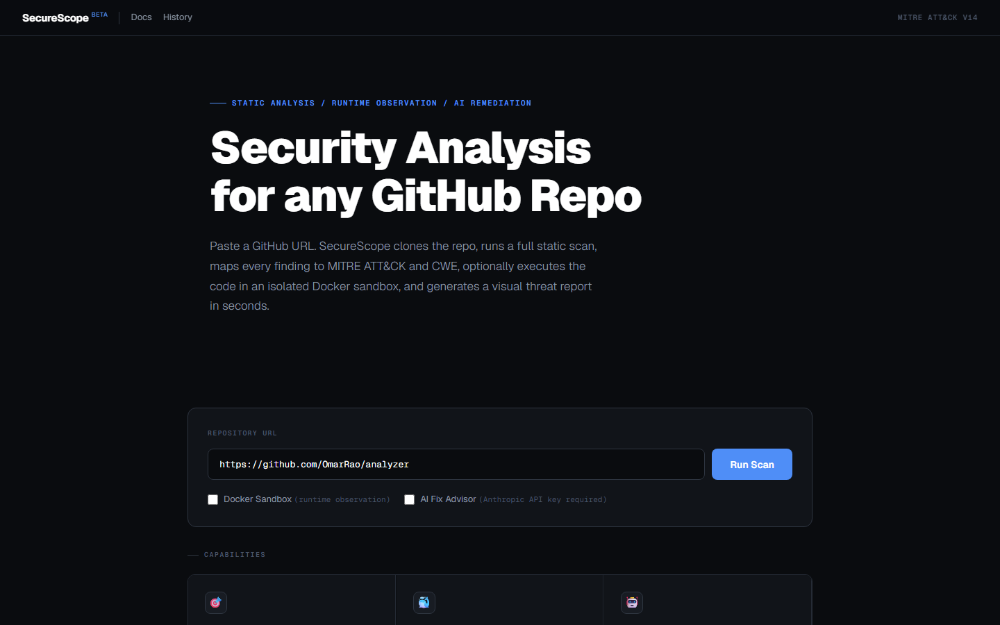
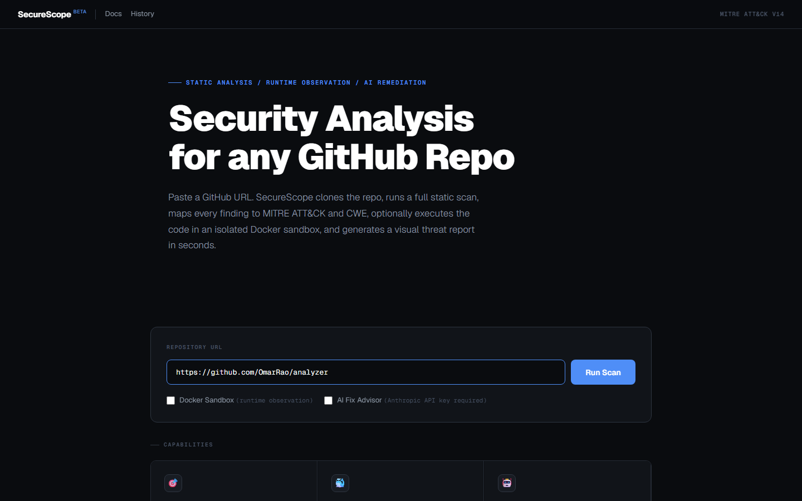
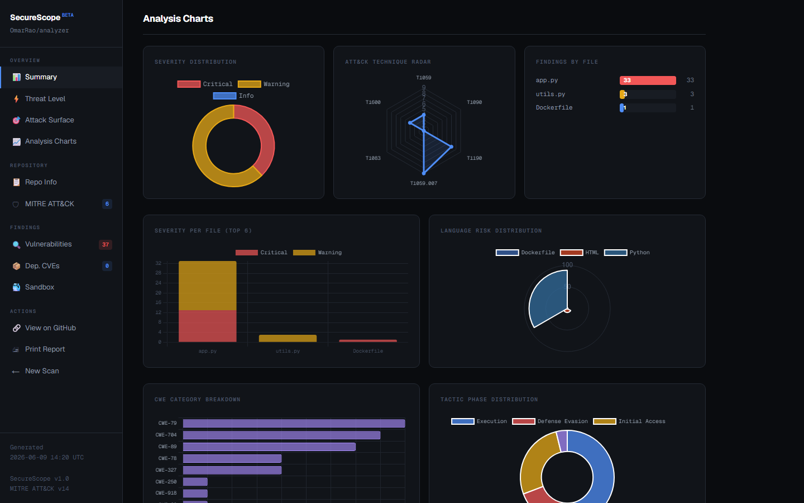
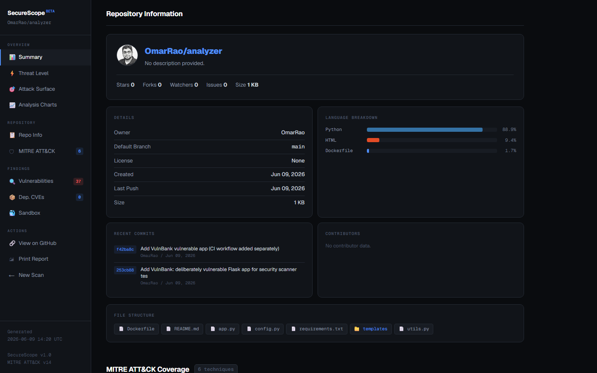
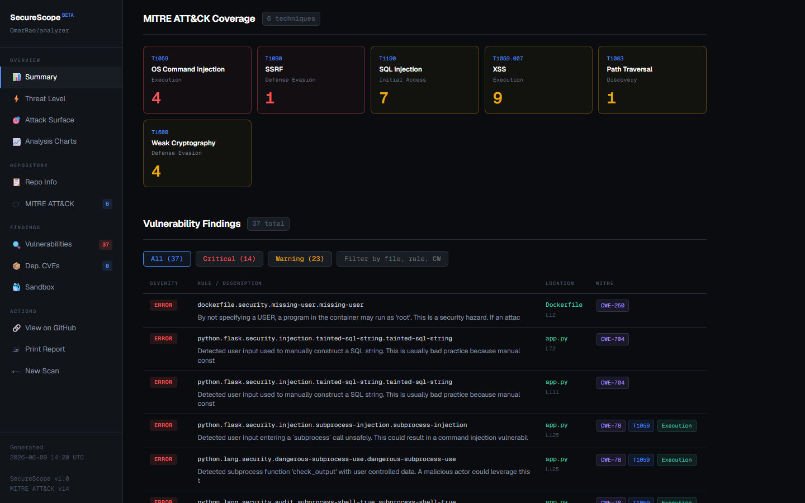
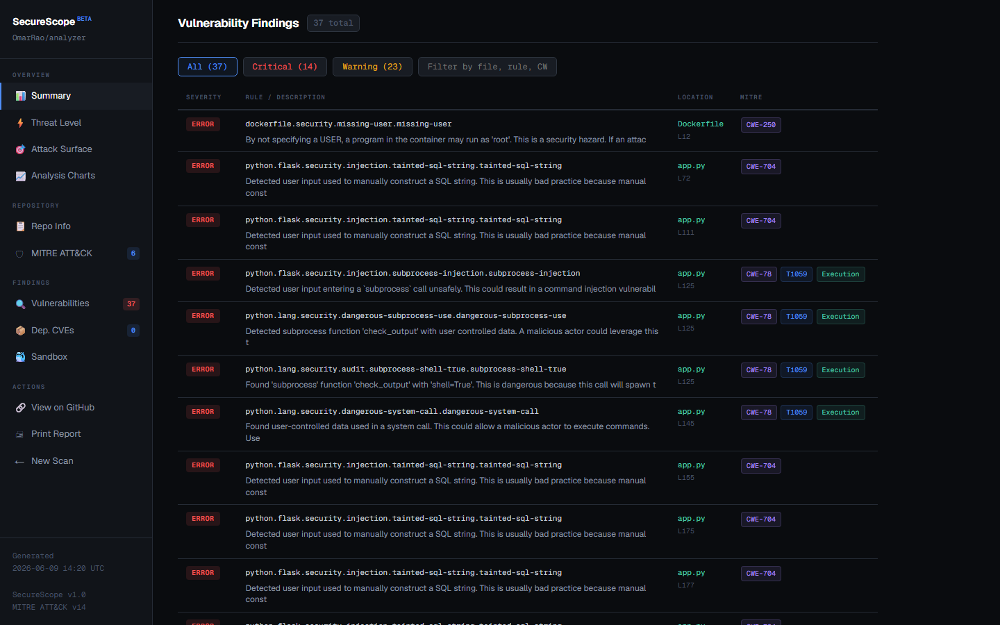

# SecureScope / GitHub Security Review Tool

> AI-powered security analysis for any GitHub repository. Paste a URL, get a full threat report mapped to MITRE ATT&CK and CWE, with optional Docker sandbox execution and AI-generated fix diffs.

---

## GitHub Security Review Tool

SecureScope scans any GitHub repository for security vulnerabilities, maps every finding to the MITRE ATT&CK framework and CWE identifiers, computes a composite threat score, and produces a visual interactive report. Optionally runs the target code in an isolated Docker sandbox to observe runtime behaviour, and uses Claude to generate diff-style patches for each finding.

### Landing Page

Paste any GitHub URL and click **Run Scan**. Live progress steps update in real time as the pipeline moves through repo cloning, Semgrep analysis, CVE auditing, sandbox execution, and report generation.





---

## Sample Report

The screenshots below are taken from a live scan of [`OmarRao/analyzer`](https://github.com/OmarRao/analyzer), a deliberately vulnerable Python Flask application containing 37 findings across 6 MITRE ATT&CK techniques.

**[View Full Sample Report](reports/sample_report_ui.html)**

---

### Report Overview

The report header shows the repository name, description, branch, language, license, scan timestamp, and a prominent **Risk Score** badge (0-100) with a threat grade: `CRITICAL`, `HIGH`, `MEDIUM`, or `LOW`. Five KPI cards break down critical findings, warnings, dependency CVEs, ATT&CK technique count, and sandbox exit code.


---

### Threat Level

A full-width composite risk bar visualises the score against four bands. Below it, four score-breakdown cards show the weighted contribution of each finding type (errors x10, warnings x3, CVEs x8, runtime behaviors x15). A Priority Fix Queue lists the top 5 critical findings with file location, CWE, and ATT&CK technique for immediate remediation guidance.


---

### Attack Surface Analysis

Eight attack vector tiles show the exposure status of the codebase across the most common MITRE-mapped vulnerability classes. Each tile turns red (Exposed), amber (Detected), or green (Clear) based on findings present in the scan.

| Vector | CWE | ATT&CK |
|--------|-----|--------|
| SQL Injection | CWE-89 | T1190 Initial Access |
| Command Injection | CWE-78 | T1059 Execution |
| Cross-Site Scripting | CWE-79 | T1059.007 Execution |
| SSRF | CWE-918 | T1090 Defense Evasion |
| Path Traversal | CWE-22 | T1083 Discovery |
| Hardcoded Credentials | CWE-798 | T1552.001 Credential Access |
| Weak Cryptography | CWE-327 | T1600 Defense Evasion |
| Insecure Deserialization | CWE-502 | T1059 Execution |


---

### Analysis Charts

Six interactive Chart.js visualisations:

- **Severity Distribution** - Doughnut chart of Critical / Warning / Info counts
- **ATT&CK Technique Radar** - Radar plot across detected technique IDs
- **Findings by File** - Horizontal heatmap bars ranked by finding density
- **Severity per File** - Stacked bar chart (top 6 files, split by severity)
- **Language Risk Distribution** - Polar area chart from GitHub language stats
- **CWE Category Breakdown** - Horizontal bar of all CWE IDs ranked by frequency
- **Tactic Phase Distribution** - Doughnut of ATT&CK tactic phases present



---

### Repository Information

Pulls live data from the GitHub API: owner avatar, stars, forks, watchers, open issues, topics, license, language breakdown bars, recent commits with SHA and author, contributor cards with avatars, and the top-level file tree.



---

### MITRE ATT&CK Coverage

Technique tiles coloured by severity. Each tile shows the technique ID, name, tactic phase, and a large hit count. Red tiles indicate findings at ERROR severity; amber at WARNING.



---

### Vulnerability Findings Table

Filterable by severity (All / Critical / Warning) with a live search box. Each row shows severity badge, Semgrep rule ID, file and line number, CWE tag, ATT&CK technique tag, tactic tag, and an expandable AI Fix Advisory panel (when Anthropic API key is configured).



---

## Architecture

```
main.py              CLI entry point
analyzer.py          Semgrep static scan + CWE -> ATT&CK mapping + dep CVEs
sandbox.py           Docker isolated runtime execution with strace observation
advisor.py           Claude API fix advisor with diff generation per finding
github_agent.py      Auto-commit security fixes to GitHub branch
report.py            HTML + JSON report generation
ui/
  server.py          Flask + Socket.IO web server with real-time scan progress
  github_info.py     GitHub API fetcher (stars, commits, contributors, languages)
  templates/
    index.html       Landing page with URL input and live progress steps
    report.html      Visual report with Chart.js, threat scoring, attack surface
```

---

## Prerequisites

| Requirement | Purpose |
|-------------|---------|
| Python 3.11+ | Runtime |
| Docker Desktop | Sandbox execution |
| `git` | Repository cloning |
| Anthropic API key | AI fix advisor (optional) |
| GitHub PAT (classic, `repo` scope) | Committing fixes (optional) |

---

## Setup

```bash
pip install -r requirements.txt
```

Set environment variables:

```bash
# Windows PowerShell
[System.Environment]::SetEnvironmentVariable("ANTHROPIC_API_KEY", "sk-ant-...", "User")
[System.Environment]::SetEnvironmentVariable("GITHUB_TOKEN", "ghp_...", "User")
```

---

## Usage

### Web UI (recommended)

```bash
python -m ui.server
# Open http://localhost:5001
```

### CLI

```bash
# Static analysis only
python main.py --repo https://github.com/owner/repo --no-sandbox --no-advisor

# Full scan with Docker sandbox
python main.py --repo https://github.com/owner/repo --no-advisor

# Full scan with AI fix advisor
python main.py --repo https://github.com/owner/repo --no-sandbox

# Full scan + commit fixes to GitHub
python main.py --repo https://github.com/owner/repo --commit --branch main
```

---

## MITRE ATT&CK Mapping

| CWE | ATT&CK Technique | Tactic |
|-----|-----------------|--------|
| CWE-89 | T1190 Exploit Public-Facing Application | Initial Access |
| CWE-79 | T1059.007 JavaScript | Execution |
| CWE-78 | T1059 Command and Scripting Interpreter | Execution |
| CWE-22 | T1083 File and Directory Discovery | Discovery |
| CWE-798 | T1552.001 Credentials in Files | Credential Access |
| CWE-918 | T1090 Proxy | Defense Evasion |
| CWE-327 | T1600 Weaken Encryption | Defense Evasion |
| CWE-502 | T1059 Command and Scripting Interpreter | Execution |
| CWE-352 | T1562 Impair Defenses | Defense Evasion |
| CWE-611 | T1190 Exploit Public-Facing Application | Initial Access |

---

## Risk Scoring

The composite risk score (0-100) is calculated as:

```
score = min(
    (critical_findings x 10) +
    (warnings x 3) +
    (dependency_CVEs x 8) +
    (sandbox_suspicious_behaviors x 15),
    100
)
```

| Score | Grade |
|-------|-------|
| 70-100 | CRITICAL |
| 45-69 | HIGH |
| 20-44 | MEDIUM |
| 0-19 | LOW |

---

## Security Notes

- Sandbox containers run with `--network internal` (no internet), 512 MB RAM cap, PID limit 128
- Fixes are committed in dry-run mode by default. Pass `--commit` to write to GitHub
- GitHub PAT needs `repo` scope only
- Cloned repositories are deleted from temp storage after each scan
