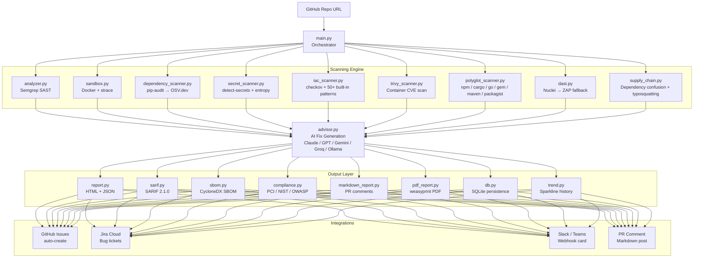
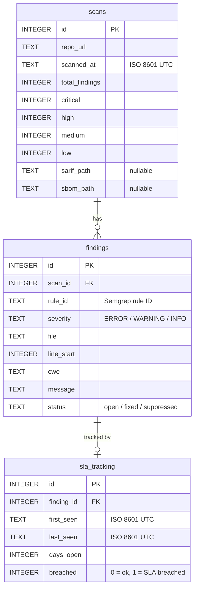

# SecureScope Technical User Guide

> **Version:** v1.10.0 | **Last Updated:** 2026-06-26 | **Maintained with each release**

---

## Table of Contents

1. [Overview](#1-overview)
2. [Architecture](#2-architecture)
3. [Installation](#3-installation)
4. [Quick Start](#4-quick-start)
5. [Core Scanning](#5-core-scanning)
6. [Report Types](#6-report-types)
7. [Advanced Scanning Modules](#7-advanced-scanning-modules)
8. [Persistence & Database](#8-persistence--database)
9. [Integrations](#9-integrations)
10. [CI/CD Integration](#10-cicd-integration)
11. [Kubernetes & Helm Deployment](#11-kubernetes--helm-deployment)
12. [Multi-Repo Scanning](#12-multi-repo-scanning)
13. [Custom Semgrep Rules](#13-custom-semgrep-rules)
14. [Telemetry](#14-telemetry)
15. [Troubleshooting](#15-troubleshooting)
16. [Version History](#16-version-history)

---

## 1. Overview

SecureScope is an AI-powered security scanner for GitHub repositories. It combines static analysis, dynamic testing, software composition analysis, and AI-generated fix advisories into a single unified workflow — from a single command or the web UI.

**What it scans:**

| Layer | Tool | What It Finds |
|-------|------|---------------|
| Static analysis (SAST) | Semgrep + custom rules | Injection, crypto flaws, insecure patterns |
| Dependency vulnerabilities | pip-audit → OSV.dev | CVEs in Python, npm, Go, Rust, Ruby, Java, PHP packages |
| Secrets | detect-secrets + entropy | API keys, credentials, private keys committed to source |
| Infrastructure-as-Code | Checkov + built-in patterns | Cloud misconfigs across Terraform, K8s, Dockerfile, GHA |
| Container images | Trivy | CVEs in base images and OS packages |
| Dynamic testing (DAST) | Nuclei + ZAP | Live endpoint vulnerabilities |
| Supply chain | Custom checks | Dependency confusion, typosquatting |
| Runtime behaviour | Docker + strace | Sandbox observation of suspicious execution |

**Security framework coverage:**

| Framework | Version | What SecureScope maps to |
|-----------|---------|--------------------------|
| CWE | MITRE CWE | Every Semgrep finding tagged with CWE ID |
| MITRE ATT&CK | v14 | Technique + tactic for each CWE |
| OWASP | Top 10 2021 + API Top 10 2023 | Compliance posture section |
| PCI DSS | v4.0 | Requirement-level mapping in compliance report |
| NIST SP 800-53 | Rev 5 | Control-level mapping in compliance report |
| SANS Top 25 | 2023 | Ranked hit list |
| ISO 27001 | 2022 | Annex A control mapping |

**Screenshot:** `docs/screenshots/01_hero.png`

---

## 2. Architecture



**Key files:**

| File | Role |
|------|------|
| `main.py` | CLI entry point — argument parsing and scan orchestration |
| `analyzer.py` | Semgrep runner, CWE→ATT&CK mapping, dependency CVEs |
| `sandbox.py` | Docker-isolated execution with strace observation |
| `advisor.py` | Multi-provider AI fix advisor |
| `report.py` | HTML + JSON report generation |
| `sarif.py` | SARIF 2.1.0 export |
| `sbom.py` | CycloneDX SBOM generation |
| `compliance.py` | Compliance posture mapping |
| `db.py` | SQLite persistence layer |
| `sla_tracker.py` | SLA breach detection |
| `jira_integration.py` | Jira Cloud issue creation |
| `polyglot_scanner.py` | Multi-ecosystem dependency scanner |
| `webhook.py` | GitHub webhook server |

---

## 3. Installation

### Method 1: pip — Minimal (fastest, no AI or Docker)

```powershell
pip install semgrep pip-audit requests detect-secrets
git clone https://github.com/OmarRao/secure-scope.git
cd secure-scope
```

Use with `--no-advisor --no-sandbox` for zero-dependency scanning.

### Method 2: pip — Full

```powershell
pip install -r requirements.txt

# Optional extras — install any you need:
pip install openai                  # OpenAI GPT-4o advisor
pip install google-generativeai     # Google Gemini advisor
pip install groq                    # Groq Llama advisor
pip install yara-python             # YARA rule scanning
pip install checkov                 # Deep IaC scanning (falls back to built-in patterns without it)
pip install weasyprint              # PDF export (--pdf flag)
pip install pip-licenses            # Richer license compliance data
```

**Optional dependency matrix:**

| Package | Feature unlocked |
|---------|-----------------|
| `openai` | `--advisor-model gpt-4o` |
| `google-generativeai` | `--advisor-model gemini-2.0-flash` |
| `groq` | `--advisor-model llama-3.1-70b-versatile` |
| `yara-python` | YARA rule evaluation (degrades gracefully without it) |
| `checkov` | Full IaC policy engine (50+ built-in patterns used as fallback) |
| `weasyprint` | `--pdf` export |
| `pip-licenses` | Accurate license detection for `--license-scan` |
| `docker` (SDK) | `--sandbox` Docker execution |
| `nuclei` (binary) | `--dast-url` Nuclei DAST scanning |

### Method 3: Docker

```powershell
docker pull ghcr.io/omarrao/secure-scope:latest

docker run --rm `
  -e GITHUB_TOKEN=$env:GITHUB_TOKEN `
  -e ANTHROPIC_API_KEY=$env:ANTHROPIC_API_KEY `
  -v ${PWD}/reports:/reports `
  ghcr.io/omarrao/secure-scope:latest `
  --repo https://github.com/owner/repo `
  --no-sandbox --sarif --out-dir /reports
```

---

## 4. Quick Start

Five examples in order of increasing completeness:

### Example 1 — Minimal scan (no AI, no Docker)

```powershell
python main.py --repo https://github.com/owner/repo --no-advisor --no-sandbox
```

**Terminal output:**

```
============================================================
  Security Review: https://github.com/owner/repo
============================================================

[*] Cloning https://github.com/owner/repo ... done (1.2s)
[*] Running Semgrep ... 47 findings
[*] Running pip-audit ... 3 CVEs
[*] Skipping sandbox (--no-sandbox)
[*] Skipping AI advisor (--no-advisor)

[+] Static analysis complete:
    Findings : 47
    CVEs     : 3

[+] HTML report: ./reports/repo_20260626_143022.html
[+] JSON report: ./reports/repo_20260626_143022.json

============================================================
  Done. Reports saved to: reports/
============================================================

Summary
  Total findings : 47
  ERROR (HIGH)   : 12
  WARNING (MED)  : 28
  INFO (LOW)     : 7
  Dependency CVEs: 3
```

### Example 2 — Full scan with AI fix advisories

```powershell
$env:ANTHROPIC_API_KEY = "sk-ant-..."
python main.py --repo https://github.com/owner/repo
```

The advisor enriches each finding with a patch diff and explanation using Claude.

### Example 3 — CI-ready: SARIF + SBOM + compliance

```powershell
python main.py --repo https://github.com/owner/repo `
  --no-advisor --no-sandbox `
  --sarif --sbom --compliance `
  --out-dir ./reports
```

Produces four files: `.html`, `.json`, `.sarif`, `.sbom.cyclonedx.json`, plus a `_compliance.json` side-file.

### Example 4 — Maximum scan (all modules enabled)

```powershell
python main.py --repo https://github.com/owner/repo `
  --sarif --sbom --compliance `
  --secret-scan --iac-scan --polyglot `
  --image ghcr.io/owner/repo:latest `
  --dast-url http://localhost:5000 `
  --license-scan --supply-chain --scorecard `
  --use-db --sla-check `
  --pdf --pr-comment `
  --slack-webhook $env:SLACK_WEBHOOK `
  --jira-url https://mycompany.atlassian.net `
  --jira-email me@company.com `
  --jira-token $env:JIRA_TOKEN `
  --jira-project SEC
```

### Example 5 — Multi-repo scan

```powershell
python main.py `
  --repos-file repos.txt `
  --no-advisor --no-sandbox `
  --sarif --out-dir ./multi-reports `
  --max-workers 8
```

---

## 5. Core Scanning

### 5.1 Semgrep Static Analysis

`analyzer.py` runs Semgrep against the cloned repository using:

1. **Built-in rule packs** — `p/python`, `p/security-audit`, `p/owasp-top-ten`
2. **Custom rules** — any `.yaml` files found under `rules/` in the SecureScope directory

Every finding is post-processed through a CWE→ATT&CK mapping table that adds:
- CWE ID and name
- MITRE ATT&CK technique ID and name
- ATT&CK tactic

**PR diff mode** (`--pr-diff`) restricts scanning to only files changed relative to `--base-branch` (default: `main`), dramatically reducing scan time in CI.

**False positive suppression** (`--suppress-fp RULE_ID FILE REASON`) writes to `.secscope-suppressions.json` and those findings are excluded from all subsequent reports.

### 5.2 Dependency Scanner

`analyzer.py` auto-discovers package manifests and queries OSV.dev via `pip-audit`:

| Ecosystem | Manifest Files |
|-----------|---------------|
| Python (PyPI) | `requirements.txt`, `requirements-dev.txt`, `requirements-test.txt` |
| Node.js (npm) | `package.json`, `package-lock.json` |
| Go | `go.mod` |
| Java (Maven) | `pom.xml` |
| Ruby (RubyGems) | `Gemfile.lock` |
| Rust (Cargo) | `Cargo.lock` |
| PHP (Packagist) | `composer.json` |

Each CVE finding includes: CVE ID, CVSS score, severity, summary, and the fixed version to upgrade to.

**Exploitability prioritisation (EPSS + CISA KEV).** Every CVE is enriched by `exploit_intel.py` with its **EPSS** score (FIRST.org — probability of exploitation in the next 30 days) and a **CISA KEV** flag (confirmed exploited in the wild). The dependency table is re-sorted so KEV-listed and high-EPSS CVEs appear first, each row shows a `KEV` badge and EPSS %, and a banner highlights any confirmed-exploited CVEs so you fix the ones attackers are actually using before the merely high-CVSS ones. Both feeds are free (no API key), cached for 6 hours, and best-effort — a scan still completes if a feed is unreachable.

**Reachability (`reachability.py`).** SecureScope statically checks whether each vulnerable package is actually imported/required in your source — Python (`import`, `from … import`) and JS/TS (`require`, `import`). CVEs are tagged Reachable, Not-imported (likely transitive/unused), or Unknown (ecosystems we don't parse — never hidden). Reachable CVEs sort first (`R` badge, "Reachable" KPI), so you tackle vulnerabilities in code you actually run before dead transitive ones. It's an import-presence heuristic, not a full call graph — it demotes, never suppresses.

**One-click fix PRs (`dep_fix_pr.py`).** The dependency report's **Create dependency-fix PR** button (CLI: `--dep-fix-pr`; API: `POST /api/dep-fix-pr` with `{repo_url, github_token}`) bumps `requirements.txt`/`package.json` to the lowest CVE-clearing version for each package and opens one prioritised PR. Supply a GitHub token with Contents + Pull-requests write access; it is used once and never stored. Review and run your tests before merging — a bump can introduce breaking changes.

### 5.3 Docker Sandbox

`sandbox.py` executes the cloned repository inside a locked-down Docker container:

- Network: `--network internal` (no internet egress)
- Memory: 512 MB cap
- PIDs: limit 128
- Filesystem: read-only bind mount of repo
- Observation: `strace` syscall tracing captures suspicious behaviours

The sandbox is **skipped by default** when Docker is unavailable — it degrades gracefully. Use `--no-sandbox` to explicitly skip it in CI environments.

### 5.4 AI Fix Advisor

`advisor.py` sends each finding (up to `--max-findings`, default 20) to an LLM and returns a patch diff with explanation.

**Configuring each provider:**

```powershell
# Anthropic Claude (highest quality)
$env:ANTHROPIC_API_KEY = "sk-ant-..."
python main.py --repo https://github.com/owner/repo

# Specify a different Claude model
python main.py --repo https://github.com/owner/repo --advisor-model claude-sonnet-4-6

# OpenAI GPT-4o
$env:OPENAI_API_KEY = "sk-..."
python main.py --repo https://github.com/owner/repo --advisor-model gpt-4o

# Google Gemini (free tier available)
$env:GEMINI_API_KEY = "AIza..."
python main.py --repo https://github.com/owner/repo --advisor-model gemini-2.0-flash

# Groq Llama (free tier, very fast)
$env:GROQ_API_KEY = "gsk_..."
python main.py --repo https://github.com/owner/repo --advisor-model llama-3.1-70b-versatile

# Local Ollama (no API key required)
python main.py --repo https://github.com/owner/repo --advisor-model ollama --ollama-model llama3

# Skip advisor entirely (fastest, no API cost)
python main.py --repo https://github.com/owner/repo --no-advisor
```

**Supported providers:**

| Provider | Model | Free Tier | Env Var |
|----------|-------|-----------|---------|
| Anthropic Claude | claude-sonnet-4-6 | No | `ANTHROPIC_API_KEY` |
| OpenAI | gpt-4o | Limited | `OPENAI_API_KEY` |
| Google Gemini | gemini-2.0-flash | Yes | `GEMINI_API_KEY` |
| Groq | llama-3.1-70b-versatile | Yes | `GROQ_API_KEY` |
| Ollama (local) | llama3 (configurable) | Yes | None |
| None | — | — | — |

> **Tip:** Use `--no-advisor` in CI pipelines to avoid API costs and reduce scan time. Run the advisor locally only for findings you intend to remediate.

---

## 6. Report Types

### 6.1 HTML Report

**What:** Rich, browser-viewable report with Chart.js visualisations, finding tables, compliance posture, and AI fix panels.

**When to use:** Human review, management presentations, security reviews.

**Where it goes:** `{out-dir}/{repo-slug}_{timestamp}.html`

**Command:**
```powershell
python main.py --repo https://github.com/owner/repo --no-advisor --no-sandbox
# HTML is always produced — no flag needed
```

The HTML report includes:
- Risk score badge (0–100) and threat grade
- KPI summary cards (critical/warning/info/CVEs/ATT&CK techniques)
- Six Chart.js visualisations (severity doughnut, ATT&CK radar, findings-by-file heatmap, etc.)
- Filterable findings table with expandable AI fix panels
- Dependency vulnerabilities prioritised by exploitability (EPSS %, CISA KEV, reachability) with a one-click dependency-fix PR
- **Compliance mapping** — findings mapped to PCI DSS v4.0 / NIST 800-53 / OWASP Top 10 / SANS Top 25 as a coverage matrix
- **License compliance** — dependency licenses classified for copyleft/GPL risk
- **SBOM** — CycloneDX inventory viewable in-report and downloadable as JSON
- Trend sparkline (when previous scans exist)

> In the web app (dashboard / landing scans), compliance mapping, license
> compliance, and the SBOM are generated automatically on every scan — no flags
> needed. They appear under the report's "Governance" navigation group.

**Screenshot:** `docs/screenshots/06_report_overview.png`

### 6.2 JSON Report

**What:** Machine-readable JSON with all findings, CVEs, sandbox observations, and metadata.

**When to use:** CI integration, feeding into SIEM, custom dashboards.

**Where it goes:** `{out-dir}/{repo-slug}_{timestamp}.json`

**Command:** Produced alongside HTML automatically.

### 6.3 SARIF 2.1.0

**What:** Static Analysis Results Interchange Format — the standard for uploading security findings to GitHub Code Scanning, VS Code SARIF viewer, and other tools.

**When to use:** GitHub Actions CI, to surface findings natively in the repository Security tab.

**Where it goes:** `{out-dir}/{repo-slug}_{timestamp}.sarif`

**Command:**
```powershell
python main.py --repo https://github.com/owner/repo --no-advisor --no-sandbox --sarif
```

Upload to GitHub Code Scanning:
```yaml
- uses: github/codeql-action/upload-sarif@v3
  with:
    sarif_file: ./reports/
```

### 6.4 CycloneDX SBOM

**What:** Software Bill of Materials in CycloneDX 1.4 JSON format — lists every dependency with version, license, and known CVEs.

**When to use:** Dependency-Track ingestion, SBOM diffing between releases, GitHub Dependency Submission API, compliance audits.

**Where it goes:** `{out-dir}/{repo-slug}_{timestamp}.sbom.cyclonedx.json`

**Command:**
```powershell
python main.py --repo https://github.com/owner/repo --no-advisor --no-sandbox --sbom
```

### 6.5 Compliance Posture HTML

**What:** An additional section in the HTML report (and a `_compliance.json` side-file) mapping findings to PCI DSS v4.0 requirements, NIST SP 800-53 controls, OWASP Top 10 / API Top 10 categories, and SANS Top 25 rankings.

**When to use:** Compliance reporting, audit preparation, QSA evidence packages.

**Command:**
```powershell
python main.py --repo https://github.com/owner/repo --no-advisor --no-sandbox --compliance
```

### 6.6 Markdown PR Comment

**What:** A concise markdown summary of the scan posted as a comment to the open pull request.

**When to use:** PR review workflow — reviewers see findings without leaving GitHub.

**Command:**
```powershell
python main.py --repo https://github.com/owner/repo --no-advisor --no-sandbox `
  --pr-comment --github-token $env:GITHUB_TOKEN
```

Use `--pr-number N` to target a specific PR; otherwise the latest open PR is auto-detected.

### 6.7 PDF Export

**What:** The HTML report rendered to PDF via weasyprint.

**When to use:** Email attachments, archiving, offline review.

**Where it goes:** `{out-dir}/{repo-slug}_{timestamp}.pdf`

**Command:**
```powershell
pip install weasyprint
python main.py --repo https://github.com/owner/repo --no-advisor --no-sandbox --pdf
```

---

## 7. Advanced Scanning Modules

### 7.1 Secret Scanning (`--secret-scan`)

**Purpose:** Detect hardcoded secrets — API keys, credentials, private keys — in source code and git commit history.

**Requirements:** `pip install detect-secrets`

**Command:**
```powershell
python main.py --repo https://github.com/owner/repo --no-advisor --no-sandbox --secret-scan
```

**What it checks:**

| Category | Examples |
|----------|---------|
| Cloud | AWS Access Key/Secret, Azure Connection Strings, GCP Service Account JSON |
| AI / ML | Anthropic, OpenAI, Groq, HuggingFace, Cohere keys |
| Version Control | GitHub PAT (classic, fine-grained, OAuth, Actions), GitLab tokens |
| Payment | Stripe, Square, Braintree |
| Communications | Slack (bot/user/app/webhook), Twilio, SendGrid, Mailgun |
| Cryptographic Keys | RSA, EC, OpenSSH, PGP, PKCS#8 private keys, JWT tokens |
| Database | MongoDB, PostgreSQL, MySQL, Redis connection strings |
| Generic | Hardcoded passwords, Bearer tokens, Basic Auth in URLs |
| Entropy | Shannon entropy ≥ 4.6 bpc — catches unknown secret patterns |

> **Note:** Secrets committed to git history remain in every clone forever. SecureScope scans commit diffs, not just HEAD. Each finding includes which commit introduced the secret and a blast-radius assessment of what an attacker can do with it.

**Example output:**
```
[*] Scanning for hardcoded secrets...
[+] Secrets: 4 potential secrets found
    CRITICAL  AWS Access Key  config.py:12  (T1552.001)
    HIGH      Stripe Secret   payments.py:8
    HIGH      GitHub PAT      .env.example:3
    MEDIUM    High-entropy    utils.py:44  (entropy=5.2)
```

### 7.2 IaC Scanning (`--iac-scan`)

**Purpose:** Detect cloud and container misconfigurations in infrastructure-as-code files before they reach production.

**Requirements:** `pip install checkov` (optional — 50+ built-in patterns work without it)

**Command:**
```powershell
python main.py --repo https://github.com/owner/repo --no-advisor --no-sandbox --iac-scan
```

**Supported frameworks:**

| Framework | File Patterns | What's Checked |
|-----------|--------------|----------------|
| Terraform | `*.tf` | Public S3, open security groups (0.0.0.0/0), public RDS, wildcard IAM, disabled encryption |
| Kubernetes | `*.yml`/`*.yaml` with apiVersion/kind | Privileged containers, hostNetwork, root UID, wildcard RBAC, `:latest` tags |
| Dockerfile | `Dockerfile*` | Root USER, `ADD` vs `COPY`, `:latest` base, hardcoded ENV secrets, `curl \| bash` |
| GitHub Actions | `.github/workflows/*.yml` | `write-all` permissions, unpinned actions, script injection, hardcoded credentials |
| CloudFormation | `*.yml`/`*.json` with CF markers | Public RDS, public S3 ACLs, wildcard IAM, missing DeletionPolicy |
| Ansible | `*.yml` with `hosts:` | `become: yes` escalation, `no_log: false` on secrets, disabled TLS validation |

### 7.3 Polyglot Dependency Scanning (`--polyglot`)

**Purpose:** Scan dependency files beyond Python — npm, Cargo, Go modules, RubyGems, Maven, Packagist — all in one pass.

**Command:**
```powershell
python main.py --repo https://github.com/owner/repo --no-advisor --no-sandbox --polyglot
```

**Example output per ecosystem:**

```
[*] Running polyglot dependency scan...

  [npm]    package.json: 12 packages scanned
    CRITICAL  lodash@4.17.15    CVE-2021-23337  Prototype pollution
    HIGH      axios@0.21.1      CVE-2021-3749   ReDoS

  [cargo]  Cargo.lock: 38 packages scanned
    HIGH      openssl@0.10.35   CVE-2021-3711   Buffer overflow in SM2

  [go]     go.mod: 7 packages scanned
    MEDIUM    golang.org/x/crypto@v0.0.0-20200622  CVE-2020-29652  Nil pointer deref

  [bundler] Gemfile.lock: 24 packages scanned
    MEDIUM    nokogiri@1.11.1   CVE-2021-30560  Libxml2 use-after-free

[+] Polyglot: 4 dependency issues across all ecosystems
```

### 7.4 DAST — Dynamic Application Security Testing (`--dast-url`)

**Purpose:** Run active vulnerability scanning against a live running instance of the application.

**Requirements:** Nuclei binary (preferred) or Docker for OWASP ZAP fallback.

**Command:**
```powershell
# Start your app first, then:
python main.py --repo https://github.com/owner/repo --no-advisor --no-sandbox `
  --dast-url http://localhost:5000
```

SecureScope tries Nuclei first (critical/high/medium severity templates), then falls back to ZAP baseline scan via Docker if Nuclei is not installed. Results are merged into the HTML report.

> **Warning:** Only point `--dast-url` at a local or isolated test instance. DAST actively probes endpoints and may trigger security controls or create unwanted data.

### 7.5 Container Scanning (`--image`)

**Purpose:** Scan a Docker container image for OS and package CVEs using Trivy.

**Requirements:** Trivy binary installed and in PATH.

**Command:**
```powershell
# Pull the image first, then scan:
docker pull ghcr.io/owner/repo:latest
python main.py --repo https://github.com/owner/repo --no-advisor --no-sandbox `
  --image ghcr.io/owner/repo:latest
```

Also scans any `Dockerfile*` found in the repository for IaC misconfigurations.

Results saved to: `{out-dir}/{repo-slug}_{timestamp}_trivy.json`

### 7.6 Supply Chain / Typosquatting (`--supply-chain`)

**Purpose:** Detect dependency confusion attacks and known typosquatted package names.

**Command:**
```powershell
python main.py --repo https://github.com/owner/repo --no-advisor --no-sandbox --supply-chain
```

Checks:
- **Dependency confusion** — internal-looking package names that also exist on public PyPI/npm registries (potential namespace hijacking)
- **Typosquatting** — known misspellings of popular packages (e.g., `requets` → `requests`, `flask-cors` variants)

### 7.7 License Compliance (`--license-scan`)

**Purpose:** Classify all dependency licenses by compliance risk — critical for commercial software and PCI DSS scope.

**Requirements:** `pip install pip-licenses` (optional — heuristic fallback used without it)

**Command:**
```powershell
python main.py --repo https://github.com/owner/repo --no-advisor --no-sandbox --license-scan
```

**Risk classification:**

| Risk Level | License SPDX Identifiers |
|-----------|--------------------------|
| High (copyleft) | GPL-2.0, GPL-3.0, AGPL-3.0, LGPL-2.1 |
| Medium (weak copyleft) | MPL-2.0, EPL-2.0, CDDL |
| Low | LGPL-3.0 |
| OK (permissive) | MIT, Apache-2.0, BSD-2-Clause, BSD-3-Clause, ISC, Unlicense, CC0, PSF |

### 7.8 OpenSSF Scorecard (`--scorecard`)

**Purpose:** Fetch the repository's OpenSSF Scorecard — a 0–10 security hygiene score across 10 checks.

**Command:**
```powershell
python main.py --repo https://github.com/owner/repo --no-advisor --no-sandbox --scorecard
```

Uses the local `scorecard` CLI if installed, otherwise falls back to the public REST API at `api.securityscorecards.dev`. Results rendered as a check-by-check table in the HTML report.

**Score interpretation:**

| Score | Meaning |
|-------|---------|
| 8–10 | Strong security posture |
| 5–7 | Moderate — some checks failing |
| 0–4 | Significant hygiene gaps |

**The 10 checks:** Branch-Protection, CI-Tests, CII-Best-Practices, Code-Review, Contributors, Dangerous-Workflow, Dependency-Update-Tool, Maintained, Pinned-Dependencies, Token-Permissions.

### 7.9 SBOM Diffing (`--sbom-diff`)

**Purpose:** Compare two SBOM snapshots to see what dependencies were added, removed, or changed between releases.

**Command:**
```powershell
# First scan — generate baseline SBOM:
python main.py --repo https://github.com/owner/repo --no-advisor --no-sandbox --sbom `
  --out-dir ./baseline

# Second scan — diff against baseline:
python main.py --repo https://github.com/owner/repo --no-advisor --no-sandbox --sbom `
  --sbom-diff ./baseline/repo_20260620_120000.sbom.cyclonedx.json `
  --out-dir ./current
```

Output: `{out-dir}/{repo-slug}_{timestamp}_sbom_diff.md` — markdown table of added/removed/version-changed components.

---

## 8. Persistence & Database

Use `--use-db` to persist all scan results to a local SQLite database (`secscope.db` by default, configurable with `--db-path`).

### Database Schema



### Querying the Database

```powershell
# Persist results and check SLA in one command:
python main.py --repo https://github.com/owner/repo --no-advisor --no-sandbox `
  --use-db --sla-check

# View scan history for a repo:
python -c "from db import get_scan_history; import json; print(json.dumps(get_scan_history('secscope.db','https://github.com/owner/repo'), indent=2))"

# Check for SLA breaches only (after at least one --use-db scan):
python main.py --repo https://github.com/owner/repo --no-advisor --no-sandbox `
  --use-db --sla-check
```

**SLA thresholds** (defaults, configurable in `sla_tracker.py`):

| Severity | SLA threshold |
|----------|--------------|
| CRITICAL | 1 day |
| HIGH | 7 days |
| MEDIUM | 30 days |
| LOW | 90 days |

When a breach is detected, `sla_tracker.py` can automatically post to the configured `--slack-webhook`.

### Custom DB Path

```powershell
python main.py --repo https://github.com/owner/repo --no-advisor `
  --use-db --db-path /data/secscope/org-scans.db
```

---

## 9. Integrations

### 9.1 GitHub Issues

Automatically creates labelled, deduplicated GitHub Issues for findings at or above the ERROR threshold.

```powershell
python main.py --repo https://github.com/owner/repo --no-advisor --no-sandbox `
  --create-issues --github-token $env:GITHUB_TOKEN
```

Issues are created with labels: `security`, `secscope`, `critical` (red), `warning` (orange), `info` (blue), plus a `cwe-NNN` label where applicable. Deduplication prevents re-creating issues that already exist for the same rule+file combination.

### 9.2 Jira Cloud

Creates Bug tickets in a Jira project for all HIGH+ severity findings. Deduplication is performed via JQL search before creation.

```powershell
python main.py --repo https://github.com/owner/repo --no-advisor --no-sandbox `
  --jira-url https://mycompany.atlassian.net `
  --jira-email me@company.com `
  --jira-token $env:JIRA_API_TOKEN `
  --jira-project SEC
```

Each Jira issue includes: CWE ID, ATT&CK technique, file/line, severity, and the SecureScope finding message. The `--jira-token` is a Jira API token (not your password) — generate one at `id.atlassian.com`.

### 9.3 Slack

Post a scan completion summary card to any Slack channel via an incoming webhook.

```powershell
$env:SLACK_WEBHOOK = "https://hooks.slack.com/services/T.../B.../..."
python main.py --repo https://github.com/owner/repo --no-advisor --no-sandbox `
  --slack-webhook $env:SLACK_WEBHOOK
```

The card includes: repo name, total findings by severity, top 3 criticals, and a link to the HTML report.

### 9.4 Microsoft Teams

```powershell
python main.py --repo https://github.com/owner/repo --no-advisor --no-sandbox `
  --teams-webhook https://your-org.webhook.office.com/webhookb2/...
```

Uses the Adaptive Card format supported by Teams incoming webhooks.

### 9.5 PR Comments

Post a markdown scan summary as a comment on the open pull request.

```powershell
python main.py --repo https://github.com/owner/repo --no-advisor --no-sandbox `
  --pr-comment --github-token $env:GITHUB_TOKEN

# Target a specific PR:
python main.py --repo https://github.com/owner/repo --no-advisor --no-sandbox `
  --pr-comment --pr-number 42 --github-token $env:GITHUB_TOKEN
```

If `--pr-number` is omitted, the latest open PR against the target branch is auto-detected.

### 9.6 GitHub App Authentication

For organisation-wide scanning (scanning repos you don't have a PAT for), authenticate as a GitHub App using installation-level tokens.

```powershell
python main.py --repo https://github.com/org/repo --no-advisor --no-sandbox `
  --github-app-id 12345 `
  --github-app-key path/to/private-key.pem
```

The app generates a short-lived installation token automatically. This is the recommended approach for org-wide CI pipelines.

---

## 10. CI/CD Integration

### GitHub Actions

The full self-scan workflow used by SecureScope itself (`.github/workflows/secscope.yml`):

```yaml
name: SecureScope Security Scan

on:
  push:
    branches: [main]
  pull_request:
    branches: [main]
  schedule:
    - cron: '0 2 * * 1'   # Every Monday at 02:00 UTC

permissions:
  security-events: write
  contents: read
  issues: write

jobs:
  secscope:
    runs-on: ubuntu-latest
    steps:
      - name: Checkout
        uses: actions/checkout@v4

      - name: Set up Python
        uses: actions/setup-python@v5
        with:
          python-version: '3.11'
          cache: 'pip'

      - name: Install SecureScope
        run: |
          pip install semgrep pip-audit requests detect-secrets checkov
          git clone https://github.com/OmarRao/secure-scope.git secscope

      - name: Run SecureScope
        env:
          GITHUB_TOKEN: ${{ secrets.GITHUB_TOKEN }}
        run: |
          python secscope/main.py \
            --repo https://github.com/${{ github.repository }} \
            --no-advisor --no-sandbox \
            --sarif --sbom --compliance \
            --secret-scan --iac-scan \
            --out-dir ./secscope-reports

      - name: Upload SARIF to GitHub Code Scanning
        uses: github/codeql-action/upload-sarif@v3
        if: always()
        with:
          sarif_file: ./secscope-reports/

      - name: Upload Reports as Artifacts
        uses: actions/upload-artifact@v4
        if: always()
        with:
          name: secscope-reports-${{ github.run_number }}
          path: secscope-reports/
          retention-days: 30

      - name: Upload SBOM to Dependency Submission API
        uses: advanced-security/spdx-dependency-submission-action@v0.1.1
        with:
          filePath: ./secscope-reports/
          filePattern: '*.sbom.cyclonedx.json'
```

**What each step does:**

| Step | Purpose |
|------|---------|
| Checkout | Clone the repo to scan |
| Install SecureScope | Install Python deps and clone SecureScope |
| Run SecureScope | Full scan with SARIF, SBOM, compliance, secrets, and IaC |
| Upload SARIF | Surface findings natively in GitHub Security tab |
| Upload Artifacts | Preserve HTML + JSON + SBOM for 30 days |
| Upload SBOM | Submit SBOM to GitHub Dependency Graph API |

**For PR-only scanning (scan only changed files):**

```yaml
      - name: Run SecureScope (PR diff mode)
        run: |
          python secscope/main.py \
            --repo https://github.com/${{ github.repository }} \
            --no-advisor --no-sandbox --sarif \
            --pr-diff --base-branch main \
            --out-dir ./secscope-reports
```

### GitLab CI

```yaml
# .gitlab-ci.yml
secscope:
  image: python:3.11
  stage: test
  script:
    - pip install semgrep pip-audit requests detect-secrets
    - git clone https://github.com/OmarRao/secure-scope.git secscope
    - python secscope/main.py
        --repo $CI_PROJECT_URL
        --no-advisor --no-sandbox
        --sarif --sbom --compliance
        --out-dir ./secscope-reports
  artifacts:
    paths:
      - secscope-reports/
    expire_in: 30 days
  allow_failure: true
```

---

## 11. Kubernetes & Helm Deployment

SecureScope can run as a persistent webhook server — listening for GitHub push and pull_request events and triggering scans automatically.

### Kubernetes

```powershell
kubectl apply -f k8s/configmap.yaml
kubectl apply -f k8s/deployment.yaml
kubectl apply -f k8s/service.yaml
```

`configmap.yaml` holds `GITHUB_TOKEN`, `ANTHROPIC_API_KEY`, and output directory configuration. The deployment runs `python main.py --webhook --port 8080`.

### Helm

```powershell
helm install secscope ./helm `
  --set env.GITHUB_TOKEN=ghp_... `
  --set env.ANTHROPIC_API_KEY=sk-ant-... `
  --set replicaCount=2 `
  --set service.type=LoadBalancer
```

**Helm values:**

| Value | Default | Description |
|-------|---------|-------------|
| `replicaCount` | `1` | Number of webhook server pods |
| `env.GITHUB_TOKEN` | `""` | GitHub PAT for repo access |
| `env.ANTHROPIC_API_KEY` | `""` | Anthropic key for AI advisor |
| `env.WEBHOOK_SECRET` | `""` | GitHub webhook HMAC secret |
| `service.type` | `ClusterIP` | `LoadBalancer` for public exposure |
| `persistence.enabled` | `true` | Mount PVC for reports and SQLite DB |

### Webhook Mode

```powershell
# Start the webhook server:
python main.py --webhook --port 8080 --webhook-secret $env:WEBHOOK_SECRET

# Or directly:
python webhook.py --port 8080 --secret $env:WEBHOOK_SECRET
```

**Configure in GitHub:** Settings → Webhooks → Add webhook
- Payload URL: `http://your-host:8080/webhook`
- Content type: `application/json`
- Secret: your `WEBHOOK_SECRET` value
- Events: `push`, `pull_request`

Each triggered scan produces JSON, HTML, SARIF, SBOM, and compliance reports automatically under `--out-dir`.

---

## 12. Multi-Repo Scanning

Scan an entire organisation's repositories in one command using a queue with configurable concurrency.

### repos.txt format

```
# One URL per line — comment lines starting with # are skipped
https://github.com/org/repo1
https://github.com/org/repo2
https://github.com/org/repo3
# https://github.com/org/archived-repo  ← skipped
```

### Queue scan command

```powershell
python main.py `
  --repos-file repos.txt `
  --no-advisor --no-sandbox `
  --sarif --sbom --compliance `
  --out-dir ./org-reports `
  --max-workers 4
```

**Terminal output:**

```
[*] Multi-repo scan: 3 repositories (max_workers=4)
[queue] 1/3 scans done  (org/repo1 — 23 findings)
[queue] 2/3 scans done  (org/repo2 — 0 findings)
[queue] 3/3 scans done  (org/repo3 — 147 findings)
```

Reports are saved to `{out-dir}/` with each repo's slug in the filename.

**Comma-separated (inline):**

```powershell
python main.py `
  --repos https://github.com/org/repo1,https://github.com/org/repo2 `
  --no-advisor --no-sandbox --sarif
```

The `--max-workers` flag (default: 4) controls how many repos scan in parallel. Set higher for large org scans, lower on resource-constrained systems.

---

## 13. Custom Semgrep Rules

SecureScope automatically loads any `.yaml` files in the `rules/` directory alongside the built-in Semgrep rule packs.

### Rule Directory Structure

```
secure-scope/
└── rules/
    ├── flask-security.yaml       # Flask-specific patterns
    ├── django-security.yaml      # Django-specific patterns
    ├── aws-sdk-misuse.yaml       # AWS SDK anti-patterns
    └── your-custom-rules.yaml   # Add your own here
```

### Writing a Custom Rule

```yaml
# rules/flask-security.yaml
rules:
  - id: flask-debug-true
    pattern: app.run(debug=True, ...)
    message: "Flask debug mode enabled — exposes Werkzeug interactive debugger to
      any visitor. Disable before any deployment."
    languages: [python]
    severity: ERROR
    metadata:
      cwe: CWE-94
      owasp: A05:2021
      references:
        - https://flask.palletsprojects.com/en/3.0.x/debugging/

  - id: flask-secret-key-weak
    patterns:
      - pattern: |
          $APP.secret_key = $VALUE
      - metavariable-regex:
          metavariable: $VALUE
          regex: '"(secret|password|test|dev|change.?me|12345)"'
    message: "Weak Flask secret key — predictable value enables session forgery."
    languages: [python]
    severity: ERROR
    metadata:
      cwe: CWE-798
```

**Pattern syntax quick reference:**

| Syntax | Matches |
|--------|---------|
| `pattern: expr` | Exact expression (wildcards with `...`) |
| `patterns: [...]` | All sub-patterns must match |
| `pattern-either: [...]` | Any sub-pattern matches |
| `pattern-not: expr` | Exclude matches |
| `metavariable-regex:` | Named capture + regex filter |
| `$X` | Any expression (metavariable) |
| `...` | Any sequence of statements |

### Testing a Rule

```powershell
# Test against a single file:
semgrep --config rules/flask-security.yaml path/to/test.py

# Test against the entire repo:
semgrep --config rules/ path/to/repo/

# Validate rule syntax:
semgrep --validate --config rules/flask-security.yaml
```

Once validated, place the file under `rules/` and SecureScope will pick it up automatically on the next scan.

---

## 14. Telemetry

SecureScope collects minimal anonymous usage telemetry to help prioritise development.

**What is collected:**
- SecureScope version
- Operating system type (not version)
- Scan duration
- Number of findings by severity (not content)
- Which optional flags were used (`--sarif`, `--sbom`, etc.)
- Whether the scan succeeded or failed

**What is never collected:**
- Repository URLs or names
- Finding details, file paths, or code content
- API keys or tokens
- Any personally identifiable information

### Opting Out

```powershell
# Opt out permanently (writes to ~/.secscope/config.json):
python main.py --telemetry-opt-out

# Opt out for a single run:
python main.py --no-telemetry --repo https://github.com/owner/repo --no-advisor

# Opt out via environment variable (useful in CI):
$env:SECSCOPE_NO_TELEMETRY = "1"
python main.py --repo https://github.com/owner/repo --no-advisor
```

---

## 15. Troubleshooting

| Error | Cause | Fix |
|-------|-------|-----|
| `No module named 'docker'` | Docker SDK not installed | `pip install docker` or use `--no-sandbox` |
| `semgrep: command not found` | Semgrep not installed | `pip install semgrep` |
| `GITHUB_TOKEN not set` | Missing GitHub PAT | `$env:GITHUB_TOKEN = (gh auth token)` |
| `ANTHROPIC_API_KEY required` | Advisor enabled without key | `--no-advisor` or `$env:ANTHROPIC_API_KEY = "sk-ant-..."` |
| `f-string backslash error` | Python < 3.12 | Already fixed in v1.9.0 — upgrade Python or update SecureScope |
| `Optional not defined` | Missing import | Already fixed in v1.9.0 — pull latest |
| Trivy scan returns empty | Image not pulled locally | `docker pull <image>` first |
| Trivy not found | Trivy not installed | Install from [aquasecurity.github.io/trivy](https://aquasecurity.github.io/trivy/) |
| SARIF upload fails in GHA | Missing `security-events: write` | Add `permissions: security-events: write` to workflow |
| SLA check finds no breaches | `--use-db` not run yet | Run at least one scan with `--use-db` first |
| `weasyprint` import error | PDF export dependency missing | `pip install weasyprint` |
| Jira 401 Unauthorized | Wrong token or email | Use API token from `id.atlassian.com`, not your password |
| `checkov` not found | IaC deep scan unavailable | `pip install checkov` or rely on built-in patterns (50+ checks) |
| Webhook 400 Invalid signature | Webhook secret mismatch | Verify `WEBHOOK_SECRET` matches what's configured in GitHub |
| `No module named 'pip_audit'` | pip-audit not installed | `pip install pip-audit` |
| Multi-repo scan hangs | Worker deadlock on slow repos | Reduce `--max-workers` (try 2) |
| PDF blank/garbled | weasyprint font issue | Install system fonts: `apt install fonts-liberation` |

**Debug mode:** Set `SECSCOPE_DEBUG=1` to enable verbose logging including the full Semgrep command and output.

```powershell
$env:SECSCOPE_DEBUG = "1"
python main.py --repo https://github.com/owner/repo --no-advisor --no-sandbox
```

---

## 16. Version History

| Version | Date | Highlights |
|---------|------|------------|
| v1.10.0 | 2026-06-26 | Polyglot dependency scan (npm/cargo/go/gem/maven), SQLite persistence (`--use-db`), SLA breach tracking (`--sla-check`), Jira Cloud integration, PDF export (`--pdf`), SBOM diffing (`--sbom-diff`), Kubernetes + Helm deployment, custom Semgrep rules directory, GitHub App auth, telemetry opt-out |
| v1.9.0 | 2026-06 | Secret scanning (`--secret-scan`), IaC scanning (`--iac-scan`), markdown PR comments (`--pr-comment`), `requirements.txt` overhaul, Python 3.12 f-string fix |
| v1.8.0 | 2026-06-24 | Slack/Teams notifications, GitHub Issue auto-creation, OpenSSF Scorecard, DAST (Nuclei + ZAP), license compliance scan, supply-chain/typosquatting detection, PR diff mode, historical trend tracking, false-positive suppression, GitHub Actions CI self-scan |
| v1.7.0 | 2026-06-23 | SARIF 2.1.0 export, Trivy container scanning, CycloneDX SBOM, compliance posture report (PCI DSS/NIST/OWASP/SANS Top 25), multi-repo scanning, GitHub webhook trigger server |
| v1.6.2 | 2026-06-22 | Report completeness — Secrets Detection and Dependency Vulnerability sections added to HTML report |
| v1.6.0 | 2026-06-18 | IaC Misconfiguration Scanner — Terraform, Kubernetes, Dockerfile, GitHub Actions, CloudFormation, Ansible; checkov + 50+ built-in patterns |
| v1.5.0 | 2026-06-17 | Expanded YARA Threat Library to 11 rule sets: Cl0p, emerging ransomware, LotL techniques, credential harvesting, supply chain attacks |
| v1.4.0 | 2026-06-17 | OSV.dev dependency vulnerability scanning — 7 ecosystems, CVE lookup, CVSS scoring |
| v1.3.0 | 2026-06-16 | Secrets Detection Engine — 60+ patterns, git history scan, entropy analysis, blast radius |
| v1.2.0 | 2026-06-12 | Threat Intelligence Dashboard, YARA scanner, enterprise prevention guide, DR checklist |
| v1.0.0 | 2026-06-09 | Initial release: Semgrep scan, Docker sandbox, multi-LLM advisor, ransomware engine, visual report |

---

> This guide is updated with every release. See [CHANGELOG.md](CHANGELOG.md) for full commit-level history.
